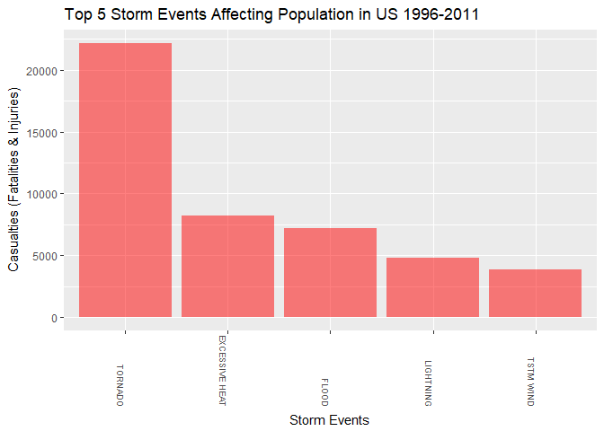

## Synopsis

In this report, I analyze the Storm data from the **U.S. National Oceanic and Atmospheric Administration**'s (NOAA) storm database, which tracks characteristics of major storms and weather events in the United States, including when and where they occur, as well as estimates of any fatalities, injuries, and property damage.

The findings revealed that:

1. **TORNADO** is the most harmful storm event causing 22,178 casualties while **EXCESSIVE HEAT** and **FLOOD** trail in second and third positions respectively.

2. The events that have the greatest economic consequence are   
**FLOOD**, causing damage of $149b, followed by **HURRICANE/TYPHOON** ($72b) and **STORM SURGE** ($43b).

## Data Processing

Load the packages used in this analysis:

```r
library(dplyr)
library(ggplot2)
```

### Download the data and load it into R: 
The storm data was downloaded from [here](https://d396qusza40orc.cloudfront.net/repdata%2Fdata%2FStormData.csv.bz2)  

The documentation on the variables contained in the file can be found [here](https://d396qusza40orc.cloudfront.net/repdata%2Fpeer2_doc%2Fpd01016005curr.pdf)  


```r
if(!dir.exists("data")){
    dir.create("data")
}

download.file("https://d396qusza40orc.cloudfront.net/repdata%2Fdata%2FStormData.csv.bz2", "data/StormData.csv.bz2")

# load the file and inspect the dimensions
stormData <- read.csv('data/StormData.csv.bz2', stringsAsFactors = FALSE)

dim(stormData)
```

```
## [1] 902297     37
```

there should be *902,297* observations and *37* variables in the stormData data frame.

### Extract only required years & required columns

The events in the database start in the year 1950 and end in November 2011. Fewer events were recorded in the earlier years due to a lack of good records. The [NOAA Storm Event Database FAQ page](https://www.ncdc.noaa.gov/stormevents/faq.jsp) highlighted that from 1996, 

> *All point data were entered by the National Weather Service (NWS) Forecast Office Warning Coordination Meteorologist (WCM) into the Storm Data database entry   program StormDat.* 

For a more accurate and consisten analysis of the storm events, I will scope the analysis period from 1996 to 2011.

Next, I remove all the observations where there is no damage to population or property b filtering out rows which have zeros in all the 4 columns **FATALITIES**, **INJURIES**, **PROPDMG** and **CROPDMG**.

The **EVTYPE** column is converted into a charcter column as it is needed to be used as a group by variable in generating the results.


```r
stormData$year <- as.numeric(format(as.Date(stormData$BGN_DATE, format = "%m/%d/%Y %H:%M:%S"), "%Y"))

storm <- stormData[stormData$year >= 1996, ]
storm <- storm[,c("EVTYPE","FATALITIES","INJURIES","PROPDMG","PROPDMGEXP","CROPDMG","CROPDMGEXP")]
storm <- storm %>% filter(FATALITIES != 0 | INJURIES != 0 | PROPDMG != 0 | CROPDMG != 0)
storm$EVTYPE = as.character(storm$EVTYPE)

dim(storm)
```

```
## [1] 201318      7
```

The subset of the storm data now contains *201318* rows and *7* columns.

### Calculate the economic damage
Next, I calculate the actual cost of damages by multiplying the cost columns (**PROPDMG**, **CROPDMG**) by the exponent columns (**PROPDMGEXP** **CROPDMGEXP**) where K, M and B are factors of 10^3^, 10^6^ and 10^9^ respectively.


```r
# Calculate actual costs (not K, M, B) of property damage and crop damage
CalcDamageCost <- function(cost, exp){
    switch(toupper(as.character(exp)),
            K = cost * 1000,
            M = cost * 1000000,
            B = cost * 1000000000,
           cost
           )
}

CalcDamageCost <- Vectorize(CalcDamageCost)

storm <- storm %>% mutate(propertyDamage = CalcDamageCost(PROPDMG, PROPDMGEXP), cropDamage = CalcDamageCost(CROPDMG, CROPDMGEXP))
```

## Results

### Events causing greatest harm to population
To find the events which caused the greatest harm to the population, A colum is created to add the fatalities and injuries for each of the observations. I then find the sum of this column *popDamage*, grouped by events to give the total population damage per event. The total damage cost is sorted in descending order and I take the top 5 rows which give the most damaging events. The list here is a consolidated list for both injuries and fatalities.


```r
popDamagebyEvent <- storm %>%
   group_by(EVTYPE) %>%
   mutate(popDamage = FATALITIES + INJURIES) %>%
   summarize(totalpopDamage = sum(popDamage)) %>%
   arrange(desc(totalpopDamage))

head(popDamagebyEvent,5)
```

```
## # A tibble: 5 x 2
##   EVTYPE         totalpopDamage
##   <chr>                   <dbl>
## 1 TORNADO                 22178
## 2 EXCESSIVE HEAT           8188
## 3 FLOOD                    7172
## 4 LIGHTNING                4792
## 5 TSTM WIND                3870
```

I take the summary created above and plot it in a barplot for the top 5 events.


```r
ggplot(head(popDamagebyEvent,5), aes(x=reorder(EVTYPE,-totalpopDamage), y=totalpopDamage)) + geom_bar(stat="identity",fill = "red",
        alpha = .5) + theme(axis.text.x = element_text(angle = 270, hjust = 1, size = 7)) + labs(title = "Top 5 Storm Events Affecting Population in US 1996-2011", x = "Storm Events", y = "Casualties (Fatalities & Injuries)")
```

<!-- -->

The graph shows that **TORNADO** caused the most causalties (22,178) in the US for the study period. **EXCESSIVE HEAT** (8188) is second while **FLOOD** (7172) comes in third.

### Events have the greatest economic consequences
I aggregate by event, the costs of the property damage `propertyDamage` and crop damage `cropDamage`. I arrange by descending order of damage cost and take the top 5 rows to plot in a gglot.


```r
econDamagebyEvent <- storm %>%
  mutate(econDamage = propertyDamage + cropDamage) %>%
  group_by(EVTYPE) %>%
  summarize(totaleconDamage = sum(econDamage)) %>%
  arrange(desc(totaleconDamage))

head(econDamagebyEvent,5)
```

```
## # A tibble: 5 x 2
##   EVTYPE            totaleconDamage
##   <chr>                       <dbl>
## 1 FLOOD                148919611950
## 2 HURRICANE/TYPHOON     71913712800
## 3 STORM SURGE           43193541000
## 4 TORNADO               24900370720
## 5 HAIL                  17071172870
```

I take the summary created above and plot it in a barplot for the top 5 events.


```r
ggplot(head(econDamagebyEvent,5), aes(x=reorder(EVTYPE,-totaleconDamage), y=totaleconDamage/10^9)) + geom_bar(stat="identity",fill = "blue",
        alpha = .5) + theme(axis.text.x = element_text(angle = 270, hjust = 1, size = 7)) + labs(title = "Top 5 Storm Events Causing Economic Damage in US 1996-2011", x = "Storm Events", y = "Economic Damage (Billions of $)")
```

<!-- -->

**FLOOD**, causing damage of $149b is the top storm event, followed by **HURRICANE/TYPHOON** ($72b) and **STORM SURGE** ($43b) in second and third place respectively.
